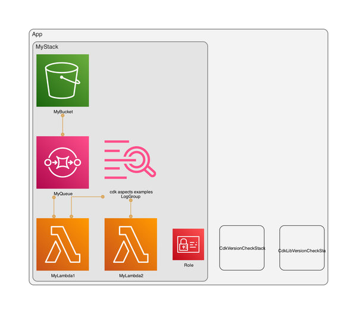

# AWS CDK Aspects Examples

This repository contains examples of using CDK Aspects.

It is referenced in this blog post: [https://blog.jannikwempe.com/mastering-aws-cdk-aspects](https://blog.jannikwempe.com/mastering-aws-cdk-aspects)

---

**This fork is an extended version of the original repository.**              

## Additions:

### Check out the 'add-aspects' folder, I put some new examples there
- **Logic with using an addAspects function.**
- **Using aspects to rename a launchTemplate name.**
- **Some examples of more checks.**

### Updated to latest AWS CDK version                
> **`"aws-cdk": "2.140.0"`**      

**The AWS environment where the deployment will take place depends on the CLI's current credential settings:**

```typescript
export const env = {
    region: process.env.CDK_DEFAULT_REGION,
    account: process.env.CDK_DEFAULT_ACCOUNT,
};
```

### CDK-NAG Package     
**[cdk-nag on GitHub](https://github.com/cdklabs/cdk-nag)**                 
**[AWS Blog Post](https://aws.amazon.com/blogs/devops/manage-application-security-and-compliance-with-the-aws-cloud-development-kit-and-cdk-nag/)**     
> **un-comment the next line in `bin/cdk-aspects-examples.ts` for checks.**                   
> **`appAspects.add(new AwsSolutionsChecks());`.**                   

### Added 2 functions to check and update the AWS-CDK and AWS-CDK-LIB packages                  
> **`cdk-check.ts`**           
> **`lib-check.ts`**   

**Example output:**                    
```
==================================================================
=== The latest version of the AWS-CDK package is:  [ 2.140.0 ] ===
=== You have the latest AWS-CDK version installed: [ 2.140.0 ] ===
=== Release info: https://github.com/aws/aws-cdk/releases      ===
==================================================================

---

======================================================================
=== The latest version of the AWS-CDK-LIB package is:  [ 2.140.0 ] ===
=== You have the latest AWS-CDK-LIB version installed: [ 2.140.0 ] ===
=== Release info: https://github.com/aws/aws-cdk/releases          ===
======================================================================

---

Adding log group for Lambda function MyStack/MyLambda1/Resource
Lambda functionName: ${Token[MyStack.MyLambda1.Resource.LogicalID.90]}
Adding log group for Lambda function MyStack/MyLambda2/Resource
Lambda functionName: ${Token[MyStack.MyLambda2.Resource.LogicalID.123]}
[Warning at /MyStack/MyBucket/Resource] 
[The MyBucketF68F3FF0-bucket is NOT secure!]
[For now, we apply BlockPublicAccess.BLOCK_ALL to your (MyBucketF68F3FF0-bucket) automatic.]

---

[Info at /MyStack/MyBucket/Resource] 
The (MyBucketF68F3FF0-bucket) has NO versioning enabled.
If you use lifecycle rules with the expiration action
set, it will result in Amazon S3 permanently removing the object.
To prevent this, versioned has to be set to 'true'.
-----------------------------------------------------------------
Example:  |  versioned: true,            |
          |  lifecycleRules: [{          |
          |  enabled: true,              |
          |  id: 'BucketLifeCycleRules',                   |
          |  noncurrentVersionExpiration: Duration.days(365), |
          |  },     |
          |  {      |
          |  noncurrentVersionTransitions: [{                 |
          |  storageClass: StorageClass.INFREQUENT_ACCESS,    |
          |  transitionAfter: Duration.days(30),              |
          |  },     |
          |  {      |
          |  storageClass: StorageClass.GLACIER,              |
          |  transitionAfter: Duration.days(60),              |
          |  }      |
          |  ]      |
          |  }]     |
-----------------------------------------------------------------
                    
[Warning at /MyStack/MyBucket/Policy/Resource] [object Object]
[Warning at /MyStack/MyLambda1/Resource] The MyStack/MyLambda1/Resource has no runtime config!]
[Warning at /MyStack/MyLambda1/Resource] The MyLambda1AAFB4554 Lambda Function runtime is updated to nodejs20.x!]

---
 
[Warning at /MyStack/MyLambda1/Resource/LogGroup/Resource] 
Unexpected deletion policy set.
We expect that deletion/removal policy to be set to RemovalPolicy.DESTROY
-----------------------------------------------------------------
Example: |  removalPolicy: RemovalPolicy.DESTROY |
-----------------------------------------------------------------
We're adding it automatically now to your log group.
                    
[Warning at /MyStack/MyLambda2/Resource] The MyStack/MyLambda2/Resource has no runtime config!]
[Warning at /MyStack/MyLambda2/Resource] The MyLambda2254B54D5 Lambda Function runtime is updated to nodejs20.x!]

---

[Warning at /MyStack/MyLambda2/Resource/LogGroup/Resource] 
Unexpected deletion policy set.
We expect that deletion/removal policy to be set to RemovalPolicy.DESTROY
-----------------------------------------------------------------
 Example: |  removalPolicy: RemovalPolicy.DESTROY |
-----------------------------------------------------------------
We're adding it automatically now to your log group.

```

### Added more examples of using AWS CDK Aspects in the Bucket stack                
> **Check the stack: `enable-bucket-versioning.ts`.**                       
> **Enforce the Lambda NodeJS Runtime to the latest LTS version.**                                     
> **Added check for `publicAccessBlockConfiguration`.**                                
> **Added another method of checking for missing tags.**                     
> **Added check for `deletionPolicy` and use `addOverride` to change the value in the cloudformation template.**                    
> **Added check for `versioningConfiguration` and `lifecycleConfiguration`.**      
> **Added check for the Security Group ingress rule if it allows unrestricted ingress (inbound traffic) from the public internet.**        
> **Example on how to find and replace a resource name to prevent replacement after a change, see launch template example.**          
> **Some different forms of output: `addWarning` and `addInfo`.**           
> **Most of the compliance checks are also covered by cdk-nag.**                 

### CDK-DIA Package
**[cdk-dia on GitHub](https://github.com/pistazie/cdk-dia)**                         

> **Added a script for an example how to quickly create a simple diagram from your CloudFormation templates.**                      
> **Check the scripts in `package.json` or run this command in your terminal:** 
> `npm i cdk-dia && cdk synth -q && npx cdk-dia && rm -rf diagram.dot && mv -f diagram.png ./images/diagram_small.png && npm r cdk-dia`.    
> The script installs the cdk-dia package and then after it created the diagram the package is uninstalled again because it depends on outdated packages.

### Diagram Example                            
                      

---

### Useful AWS CDK commands

| Command         | Description                                                                  |
|-----------------|------------------------------------------------------------------------------|
| cdk doc         | opens the CDK API reference in your browser                                  |
| cdk init        | creates a new CDK project in the current directory from a specified template |
| cdk ls          | lists all stacks in the app                                                  |
| cdk synth -q    | pre-builds the resources, quiet                                              |
| cdk diff        | compare deployed stack with current state                                    |
| cdk deploy      | deploy this stack to your default AWS account/region                         |
| cdk import      | import existing AWS resources into a CDK stack                               |
| cdk watch       | watch for changes and compile                                                |
| cdk destroy     | destroys the specified stack(s)                                              |
| cdk bootstrap   | deploy a toolkit stack to support deploying large stacks & artifacts         |
| cdk doctor      | checks your CDK project for potential problems                               |
| cdk acknowledge | acknowledge (and hide) a notice by issue number                              |
| cdk notices     | list all relevant notices for the application                                |
| cdk metadata    | displays metadata about the specified stack                                  |
| cdk context     | show cached context values                                                   |
| --verbose -v    | show debug logs                                                              |
| --debug -d      | additional debugging info                                                    |
| --force -f      | force command, example: `cdk deploy -f `                                     |
