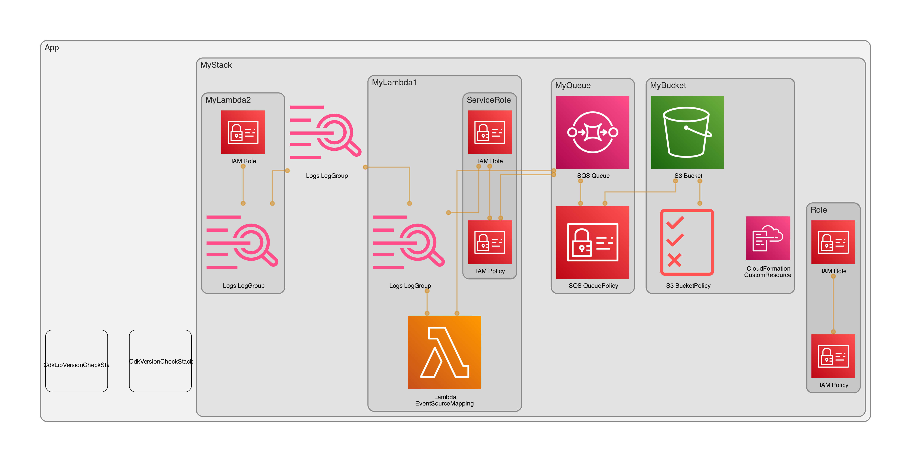

# AWS CDK Aspects Examples

This repository contains examples of using CDK Aspects.

It is referenced in this blog post: [https://blog.jannikwempe.com/mastering-aws-cdk-aspects](https://blog.jannikwempe.com/mastering-aws-cdk-aspects)

---

**This fork is an extended version of the original repository.**              

## Additions:

### Updated to latest AWS CDK version                
> **January 2024: `"aws-cdk": "2.122.0"`**      

**The AWS environment where the deployment will take place depends on the CLI's current credential settings:**

```typescript
export const env = {
    region: process.env.CDK_DEFAULT_REGION,
    account: process.env.CDK_DEFAULT_ACCOUNT,
};
```

### CDK-NAG Package     
**[cdk-nag on GitHub](https://github.com/cdklabs/cdk-nag)**                 
**[AWS Blog Post](https://aws.amazon.com/blogs/devops/manage-application-security-and-compliance-with-the-aws-cloud-development-kit-and-cdk-nag/)**     
> **un-comment the next line in `bin/cdk-aspects-examples.ts` for checks.**                   
> **`appAspects.add(new AwsSolutionsChecks());`.**                   

### Added 2 functions to check and update the AWS-CDK and AWS-CDK-LIB packages                  
> **`cdk-check.ts`**           
> **`lib-check.ts`**   

**Example output:**                    
```
==================================================================
=== The latest version of the AWS-CDK package is:  [ 2.122.0 ] ===
=== You have the latest AWS-CDK version installed: [ 2.122.0 ] ===
=== Release info: https://github.com/aws/aws-cdk/releases      ===
==================================================================

======================================================================
=== The latest version of the AWS-CDK-LIB package is:  [ 2.122.0 ] ===
=== You have the latest AWS-CDK-LIB version installed: [ 2.122.0 ] ===
=== Release info: https://github.com/aws/aws-cdk/releases          ===
======================================================================
```

### Added more examples of using AWS CDK Aspects in the Bucket stack  
> **Check the stack: `enable-bucket-versioning.ts`.**
> **Enforce the Lambda NodeJS Runtime to the latest LTS version.**                              
> **Added check for `publicAccessBlockConfiguration`.**                                
> **Added another method of checking for missing tags.**                     
> **Added check for `deletionPolicy` and use `addOverride` to change the value in the cloudformation template.**                    
> **Added check for `versioningConfiguration` and `lifecycleConfiguration`.**      
> **Added check for the Security Group ingress rule if it allows unrestricted ingress (inbound traffic) from the public internet.**

> **Most of the compliance checks are also covered by cdk-nag.**            

### CDK-DIA Package
**[cdk-dia on GitHub](https://github.com/pistazie/cdk-dia)**                         

> **Added the cdk-dia package for an example to quickly create a diagram from your CloudFormation templates.**                      
> **Check the scripts in `package.json` or run this command in your terminal: `npx cdk ls -q && npx cdk-dia --collapse=false && rm -rvf diagram.dot && mv -v diagram.png ./images/extended_diagram.png`.**   

### Diagram Example                            
                      

---

### Useful AWS CDK commands

| Command         | Description                                                                  |
|-----------------|------------------------------------------------------------------------------|
| cdk doc         | opens the CDK API reference in your browser                                  |
| cdk init        | creates a new CDK project in the current directory from a specified template |
| cdk ls          | lists all stacks in the app                                                  |
| cdk synth -q    | pre-builds the resources, quiet                                              |
| cdk diff        | compare deployed stack with current state                                    |
| cdk deploy      | deploy this stack to your default AWS account/region                         |
| cdk import      | import existing AWS resources into a CDK stack                               |
| cdk watch       | watch for changes and compile                                                |
| cdk destroy     | destroys the specified stack(s)                                              |
| cdk bootstrap   | deploy a toolkit stack to support deploying large stacks & artifacts         |
| cdk doctor      | checks your CDK project for potential problems                               |
| cdk acknowledge | acknowledge (and hide) a notice by issue number                              |
| cdk notices     | list all relevant notices for the application                                |
| cdk metadata    | displays metadata about the specified stack                                  |
| cdk context     | show cached context values                                                   |
| --verbose -v    | show debug logs                                                              |
| --debug -d      | additional debugging info                                                    |
| --force -f      | force command, example: `cdk deploy -f `                                     |
